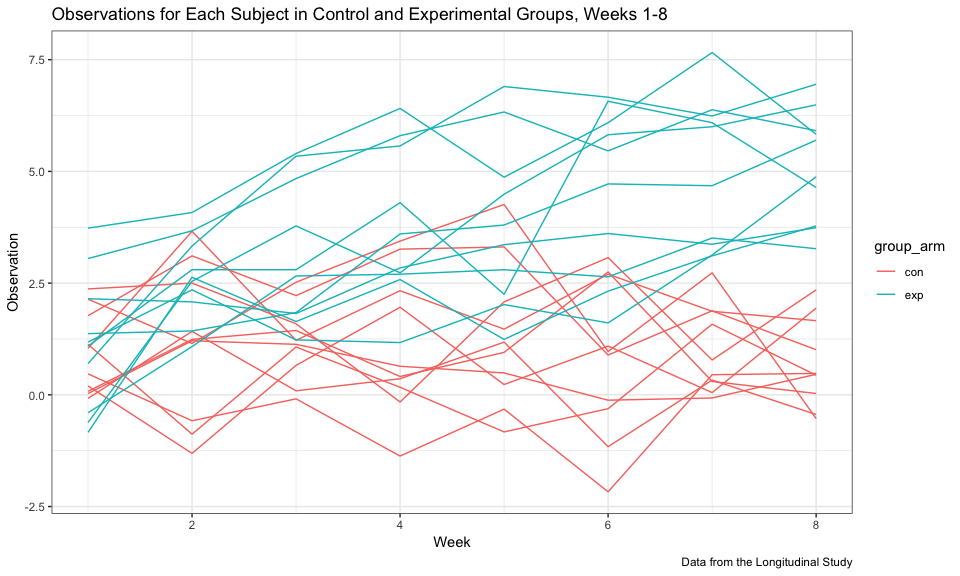

p8105\_hw5\_dm3175
================
Devon Morgan
11/5/2018

Problem 1
=========

Load and Clean Data
-------------------

First, the data from the longitudinal study was loaded and cleaned. The files were originally stored in separate csv files, but were loaded and combined into one dateframe using the `map` function. The `map` functionality iterates over the cells in the file name column to carry out the `read_csv` function, and enters the output into a new column in the data frame. Data was unnested after it was read in.

Next, data was tidied using the `gather` function to organize all observations by week of observation. Using the information stored in the file name, columns for the `subject_id` and `week` were created. The `group_arm` variable was converted into a factor variable, and the `subject_id` and `week` into numeric.

``` r
# Load list of file names into a data frame
longit_file_names = tibble(files = list.files("./data"),
                           path = str_c("./data/", files)) %>% 
  janitor::clean_names() 

# Iterate loading csvs from directory and tidy data
longit_tidy = longit_file_names %>% 
  mutate(patient_data = map(path, read_csv)) %>% 
  unnest() %>% 
  gather(key = week, value = obs, week_1:week_8) %>% 
  separate(files, into = c("group_arm", "subject_id"), sep = "_") %>% 
  mutate(subject_id = str_replace(subject_id, ".csv", ""), 
         week = str_replace(week, "week_", "")) %>% 
  mutate(group_arm = factor(group_arm, levels = c("con", "exp")),
         subject_id = as.double(subject_id), 
         week = as.double(week)) %>% 
  select(group_arm, subject_id, week, obs)
```

Spaghetti Plot of All Subjects Over Time
----------------------------------------

A spaghetti plot of all subjects from control and experimental groups over time reveals that control group observations are consistently lower than experimental group observations over time. The differences appear to be diverging more over time, with earlier time points showing more overlap between the groups and later time points showing greater differences. The observation values for the experimental group appears to be increasing over time.

``` r
longit_tidy %>% 
  group_by(subject_id, group_arm) %>% 
  ggplot(aes(x = week, y = obs, color = group_arm, group = interaction(subject_id, group_arm))) + 
  geom_line(se = FALSE) +
  labs(
    title = "Observations for Each Subject in Control and Experimental Groups, Weeks 1-8",
    x = "Week",
    y = "Observation",
    caption = "Data from the Longitudinal Study"
  ) + 
  theme_bw()
```

    ## Warning: Ignoring unknown parameters: se



Problem 2
=========

Load and Clean the Data
-----------------------

The next problem explores data gathered by the Washington Post on homicides in 50 large US cities. Data was read in from a CSV posted on GitHub.

``` r
url = "https://raw.githubusercontent.com/washingtonpost/data-homicides/master/homicide-data.csv"
homicide_data = read_csv(url, na = "Unknown") %>% 
  janitor::clean_names() 
```

    ## Parsed with column specification:
    ## cols(
    ##   uid = col_character(),
    ##   reported_date = col_integer(),
    ##   victim_last = col_character(),
    ##   victim_first = col_character(),
    ##   victim_race = col_character(),
    ##   victim_age = col_integer(),
    ##   victim_sex = col_character(),
    ##   city = col_character(),
    ##   state = col_character(),
    ##   lat = col_double(),
    ##   lon = col_double(),
    ##   disposition = col_character()
    ## )

``` r
# Clean error in state "AL" to "OK" for Tul-000769
clean_homicide_data = homicide_data %>% 
  mutate(state = ifelse(uid == "Tul-000769", "OK", state)) %>% 
  mutate(city_state = str_c(city, ", ", state))
```

The dataset contains 52179 observations and 12 variables. A new variable `city_state` was created to concatenate the city and state variables. The variables in the dataset are:

-   `uid` - unique identifier
-   `reported_date` - date homicide reported
-   `victim_last` and `victim_first` - name of victim
-   `victim_race` - race of victim
-   `victim_age` - age of victim
-   `victim_sex` - sex of victim
-   `city` - city of homicide
-   `state` - state of homicide
-   `city_state` - combination city, state
-   `lat` and `lon` - latitude and longitude of homicide
-   `disposition` - outcome of homicide with three options: "Closed by arest", "Closed without arrest", or "Open/No arrest"

An error in the original data table listed "Tulsa, AL" as a location; however, the coordinates actually corresponded to "Tulsa, OK". Therefore, the state was fixed to Oklahoma in the clean dataset.

Homicides by City, State
------------------------

### Total Homicides and Unsolved Homicides in All Cities

The total number of homicides and unsolved homicides for each city, state is provided in the table below.

``` r
total_hom_count = clean_homicide_data %>% 
  group_by(city_state) %>% 
  summarize(n_total_homicides = n())

unsolved_hom_count = clean_homicide_data %>% 
  filter(disposition == "Closed without arrest" | disposition == "Open/No arrest") %>% 
  group_by(city_state) %>% 
  summarize(n_unsolved_homicide = n())

homicide_counts = full_join(total_hom_count, unsolved_hom_count, by = "city_state") %>% 
  arrange(desc(n_total_homicides))

homicide_counts %>% 
  knitr::kable(digits = 1)
```

| city\_state        |  n\_total\_homicides|  n\_unsolved\_homicide|
|:-------------------|--------------------:|----------------------:|
| Chicago, IL        |                 5535|                   4073|
| Philadelphia, PA   |                 3037|                   1360|
| Houston, TX        |                 2942|                   1493|
| Baltimore, MD      |                 2827|                   1825|
| Detroit, MI        |                 2519|                   1482|
| Los Angeles, CA    |                 2257|                   1106|
| St. Louis, MO      |                 1677|                    905|
| Dallas, TX         |                 1567|                    754|
| Memphis, TN        |                 1514|                    483|
| New Orleans, LA    |                 1434|                    930|
| Las Vegas, NV      |                 1381|                    572|
| Washington, DC     |                 1345|                    589|
| Indianapolis, IN   |                 1322|                    594|
| Kansas City, MO    |                 1190|                    486|
| Jacksonville, FL   |                 1168|                    597|
| Milwaukee, wI      |                 1115|                    403|
| Columbus, OH       |                 1084|                    575|
| Atlanta, GA        |                  973|                    373|
| Oakland, CA        |                  947|                    508|
| Phoenix, AZ        |                  914|                    504|
| San Antonio, TX    |                  833|                    357|
| Birmingham, AL     |                  800|                    347|
| Nashville, TN      |                  767|                    278|
| Miami, FL          |                  744|                    450|
| Cincinnati, OH     |                  694|                    309|
| Charlotte, NC      |                  687|                    206|
| Oklahoma City, OK  |                  672|                    326|
| San Francisco, CA  |                  663|                    336|
| Pittsburgh, PA     |                  631|                    337|
| New York, NY       |                  627|                    243|
| Boston, MA         |                  614|                    310|
| Tulsa, OK          |                  584|                    193|
| Louisville, KY     |                  576|                    261|
| Fort Worth, TX     |                  549|                    255|
| Buffalo, NY        |                  521|                    319|
| Fresno, CA         |                  487|                    169|
| San Diego, CA      |                  461|                    175|
| Stockton, CA       |                  444|                    266|
| Richmond, VA       |                  429|                    113|
| Baton Rouge, LA    |                  424|                    196|
| Omaha, NE          |                  409|                    169|
| Albuquerque, NM    |                  378|                    146|
| Long Beach, CA     |                  378|                    156|
| Sacramento, CA     |                  376|                    139|
| Minneapolis, MN    |                  366|                    187|
| Denver, CO         |                  312|                    169|
| Durham, NC         |                  276|                    101|
| San Bernardino, CA |                  275|                    170|
| Savannah, GA       |                  246|                    115|
| Tampa, FL          |                  208|                     95|

Chicago, IL, Philadelphia, PA, and Houston, TX are the top three cities by total homicides. The table also presents the total number of unsolved homicides (those with disposition of “Closed without arrest” or “Open/No arrest”). Chicago, IL had the largest number of unsolved homicides with 4073. Baltimore, MD has the second largest number of unsolved homicides with 1825. The city with the least unsolved homicides was Tampa, FL with 95. Tulsa, AL had no unsolved homicides reported.

### Unsolved Homicides in Baltimore, MD

One sample test of the proportion of unsolved homicides in Baltimore, MD using `prop.test`:

``` r
baltimore_prop = prop.test(x = filter(homicide_counts, city_state == "Baltimore, MD") %>% pull(n_unsolved_homicide), 
          n = filter(homicide_counts, city_state == "Baltimore, MD") %>% pull(n_total_homicides)) %>% 
  broom::tidy()
    
baltimore_prop %>% select(estimate, conf.low, conf.high) %>% knitr::kable(digits = 5)
```

|  estimate|  conf.low|  conf.high|
|---------:|---------:|----------:|
|   0.64556|   0.62756|    0.66316|

### Unsolved Homicides in All Cities

Next, the proportion tests were carried out for the proportion of unsolved homicides for all cities.

``` r
homicide_counts %>% 
  mutate(prop_test = map2(.x = n_unsolved_homicide, .y = n_total_homicides, ~prop.test(x = .x, n = .y))) %>%
  mutate(prop_test = map(prop_test, broom::tidy)) %>% 
  unnest() %>% 
  select(city_state, estimate, conf.low, conf.high)
```

    ## # A tibble: 50 x 4
    ##    city_state       estimate conf.low conf.high
    ##    <chr>               <dbl>    <dbl>     <dbl>
    ##  1 Chicago, IL         0.736    0.724     0.747
    ##  2 Philadelphia, PA    0.448    0.430     0.466
    ##  3 Houston, TX         0.507    0.489     0.526
    ##  4 Baltimore, MD       0.646    0.628     0.663
    ##  5 Detroit, MI         0.588    0.569     0.608
    ##  6 Los Angeles, CA     0.490    0.469     0.511
    ##  7 St. Louis, MO       0.540    0.515     0.564
    ##  8 Dallas, TX          0.481    0.456     0.506
    ##  9 Memphis, TN         0.319    0.296     0.343
    ## 10 New Orleans, LA     0.649    0.623     0.673
    ## # ... with 40 more rows
